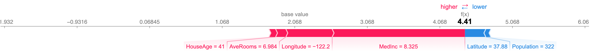
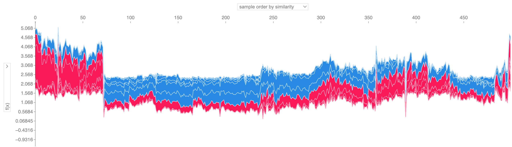

<p align="center">
  
</p>

---
[](https://pypi.org/project/shap/)
[](https://anaconda.org/conda-forge/shap)


[](https://mybinder.org/v2/gh/shap/shap/master)
[](https://shap.readthedocs.io/en/latest/?badge=latest)

[](https://pypi.org/pypi/shap/)


**SHAP (SHapley Additive exPlanations)** is a game theoretic approach to explain the output of any machine learning model. It connects optimal credit allocation with local explanations using the classic Shapley values from game theory and their related extensions (see [papers](#citations) for details and citations).

<!--**SHAP (SHapley Additive exPlanations)** is a unified approach to explain the output of any machine learning model. SHAP connects game theory with local explanations, uniting several previous methods [1-7] and representing the only possible consistent and locally accurate additive feature attribution method based on expectations (see our [papers](#citations) for details and citations).-->


## Install

SHAP can be installed from either [PyPI](https://pypi.org/project/shap) or [conda-forge](https://anaconda.org/conda-forge/shap):

<pre>
pip install shap
<i>or</i>
conda install -c conda-forge shap
</pre>

## Tree ensemble example (XGBoost/LightGBM/CatBoost/scikit-learn/pyspark models)

While SHAP can explain the output of any machine learning model, we have developed a high-speed exact algorithm for tree ensemble methods (see our [Nature MI paper](https://rdcu.be/b0z70)). Fast C++ implementations are supported for *XGBoost*, *LightGBM*, *CatBoost*, *scikit-learn* and *pyspark* tree models:

```python
import xgboost
import shap

# train an XGBoost model
X, y = shap.datasets.california()
model = xgboost.XGBRegressor().fit(X, y)

# explain the model's predictions using SHAP
# (same syntax works for LightGBM, CatBoost, scikit-learn, transformers, Spark, etc.)
explainer = shap.Explainer(model)
shap_values = explainer(X)

# visualize the first prediction's explanation
shap.plots.waterfall(shap_values[0])
```

<p align="center">
  
</p>

The above explanation shows features each contributing to push the model output from the base value (the average model output over the training dataset we passed) to the model output. Features pushing the prediction higher are shown in red, those pushing the prediction lower are in blue. Another way to visualize the same explanation is to use a force plot (these are introduced in our [Nature BME paper](https://rdcu.be/baVbR)):

```python
# visualize the first prediction's explanation with a force plot
shap.plots.force(shap_values[0])
```

<p align="center">
  
</p>

If we take many force plot explanations such as the one shown above, rotate them 90 degrees, and then stack them horizontally, we can see explanations for an entire dataset (in the notebook this plot is interactive):

```python
# visualize all the training set predictions
shap.plots.force(shap_values[:500])
```

<p align="center">
  
</p>

To understand how a single feature effects the output of the model we can plot the SHAP value of that feature vs. the value of the feature for all the examples in a dataset. Since SHAP values represent a feature's responsibility for a change in the model output, the plot below represents the change in predicted house price as the latitude changes. Vertical dispersion at a single value of latitude represents interaction effects with other features. To help reveal these interactions we can color by another feature. If we pass the whole explanation tensor to the `color` argument the scatter plot will pick the best feature to color by. In this case it picks longitude.

```python
# create a dependence scatter plot to show the effect of a single feature across the whole dataset
shap.plots.scatter(shap_values[:, "Latitude"], color=shap_values)
```

<p align="center">
  
</p>


To get an overview of which features are most important for a model we can plot the SHAP values of every feature for every sample. The plot below sorts features by the sum of SHAP value magnitudes over all samples, and uses SHAP values to show the distribution of the impacts each feature has on the model output. The color represents the feature value (red high, blue low). This reveals for example that higher median incomes increases the predicted home price.

```python
# summarize the effects of all the features
shap.plots.beeswarm(shap_values)
```

<p align="center">
  
</p>

We can also just take the mean absolute value of the SHAP values for each feature to get a standard bar plot (produces stacked bars for multi-class outputs):

```python
shap.plots.bar(shap_values)
```

<p align="center">
  
</p>

## Natural language example (transformers)

SHAP has specific support for natural language models like those in the Hugging Face transformers library. By adding coalitional rules to traditional Shapley values we can form games that explain large modern NLP model using very few function evaluations. Using this functionality is as simple as passing a supported transformers pipeline to SHAP:

```python
import transformers
import shap

# load a transformers pipeline model
model = transformers.pipeline('sentiment-analysis', return_all_scores=True)

# explain the model on two sample inputs
explainer = shap.Explainer(model)
shap_values = explainer(["What a great movie! ...if you have no taste."])

# visualize the first prediction's explanation for the POSITIVE output class
shap.plots.text(shap_values[0, :, "POSITIVE"])
```

<p align="center">
  
</p>

## Deep learning example with DeepExplainer (TensorFlow/Keras models)

Deep SHAP is a high-speed approximation algorithm for SHAP values in deep learning models that builds on a connection with [DeepLIFT](https://arxiv.org/abs/1704.02685) described in the SHAP NIPS paper. The implementation here differs from the original DeepLIFT by using a distribution of background samples instead of a single reference value, and using Shapley equations to linearize components such as max, softmax, products, divisions, etc. Note that some of these enhancements have also been since integrated into DeepLIFT. TensorFlow models and Keras models using the TensorFlow backend are supported (there is also preliminary support for PyTorch):

```python
# ...include code from https://github.com/keras-team/keras/blob/master/examples/demo_mnist_convnet.py

import shap
import numpy as np

# select a set of background examples to take an expectation over
background = x_train[np.random.choice(x_train.shape[0], 100, replace=False)]

# explain predictions of the model on four images
e = shap.DeepExplainer(model, background)
# ...or pass tensors directly
# e = shap.DeepExplainer((model.layers[0].input, model.layers[-1].output), background)
shap_values = e.shap_values(x_test[1:5])

# plot the feature attributions
shap.image_plot(shap_values, -x_test[1:5])
```

<p align="center">
  
</p>

The plot above explains ten outputs (digits 0-9) for four different images. Red pixels increase the model's output while blue pixels decrease the output. The input images are shown on the left, and as nearly transparent grayscale backings behind each of the explanations. The sum of the SHAP values equals the difference between the expected model output (averaged over the background dataset) and the current model output. Note that for the 'zero' image the blank middle is important, while for the 'four' image the lack of a connection on top makes it a four instead of a nine.


## Deep learning example with GradientExplainer (TensorFlow/Keras/PyTorch models)

Expected gradients combines ideas from [Integrated Gradients](https://arxiv.org/abs/1703.01365), SHAP, and [SmoothGrad](https://arxiv.org/abs/1706.03825) into a single expected value equation. This allows an entire dataset to be used as the background distribution (as opposed to a single reference value) and allows local smoothing. If we approximate the model with a linear function between each background data sample and the current input to be explained, and we assume the input features are independent then expected gradients will compute approximate SHAP values. In the example below we have explained how the 7th intermediate layer of the VGG16 ImageNet model impacts the output probabilities.

```python
from keras.applications.vgg16 import VGG16
from keras.applications.vgg16 import preprocess_input
import keras.backend as K
import numpy as np
import json
import shap

# load pre-trained model and choose two images to explain
model = VGG16(weights='imagenet', include_top=True)
X,y = shap.datasets.imagenet50()
to_explain = X[[39,41]]

# load the ImageNet class names
url = "https://s3.amazonaws.com/deep-learning-models/image-models/imagenet_class_index.json"
fname = shap.datasets.cache(url)
with open(fname) as f:
    class_names = json.load(f)

# explain how the input to the 7th layer of the model explains the top two classes
def map2layer(x, layer):
    feed_dict = dict(zip([model.layers[0].input], [preprocess_input(x.copy())]))
    return K.get_session().run(model.layers[layer].input, feed_dict)
e = shap.GradientExplainer(
    (model.layers[7].input, model.layers[-1].output),
    map2layer(X, 7),
    local_smoothing=0 # std dev of smoothing noise
)
shap_values,indexes = e.shap_values(map2layer(to_explain, 7), ranked_outputs=2)

# get the names for the classes
index_names = np.vectorize(lambda x: class_names[str(x)][1])(indexes)

# plot the explanations
shap.image_plot(shap_values, to_explain, index_names)
```

<p align="center">
  
</p>

Predictions for two input images are explained in the plot above. Red pixels represent positive SHAP values that increase the probability of the class, while blue pixels represent negative SHAP values the reduce the probability of the class. By using `ranked_outputs=2` we explain only the two most likely classes for each input (this spares us from explaining all 1,000 classes).

## Model agnostic example with KernelExplainer (explains any function)

Kernel SHAP uses a specially-weighted local linear regression to estimate SHAP values for any model. Below is a simple example for explaining a multi-class SVM on the classic iris dataset.

```python
import sklearn
import shap
from sklearn.model_selection import train_test_split

# print the JS visualization code to the notebook
shap.initjs()

# train a SVM classifier
X_train,X_test,Y_train,Y_test = train_test_split(*shap.datasets.iris(), test_size=0.2, random_state=0)
svm = sklearn.svm.SVC(kernel='rbf', probability=True)
svm.fit(X_train, Y_train)

# use Kernel SHAP to explain test set predictions
explainer = shap.KernelExplainer(svm.predict_proba, X_train, link="logit")
shap_values = explainer.shap_values(X_test, nsamples=100)

# plot the SHAP values for the Setosa output of the first instance
shap.force_plot(explainer.expected_value[0], shap_values[0][0,:], X_test.iloc[0,:], link="logit")
```
<p align="center">
  
</p>

The above explanation shows four features each contributing to push the model output from the base value (the average model output over the training dataset we passed) towards zero. If there were any features pushing the class label higher they would be shown in red.

If we take many explanations such as the one shown above, rotate them 90 degrees, and then stack them horizontally, we can see explanations for an entire dataset. This is exactly what we do below for all the examples in the iris test set:

```python
# plot the SHAP values for the Setosa output of all instances
shap.force_plot(explainer.expected_value[0], shap_values[0], X_test, link="logit")
```
<p align="center">
  
</p>

## SHAP Interaction Values

SHAP interaction values are a generalization of SHAP values to higher order interactions. Fast exact computation of pairwise interactions are implemented for tree models with `shap.TreeExplainer(model).shap_interaction_values(X)`. This returns a matrix for every prediction, where the main effects are on the diagonal and the interaction effects are off-diagonal. These values often reveal interesting hidden relationships, such as how the increased risk of death peaks for men at age 60 (see the NHANES notebook for details):

<p align="center">
  
</p>

## Sample notebooks

The notebooks below demonstrate different use cases for SHAP. Look inside the notebooks directory of the repository if you want to try playing with the original notebooks yourself.

### TreeExplainer

An implementation of Tree SHAP, a fast and exact algorithm to compute SHAP values for trees and ensembles of trees.

- [**NHANES survival model with XGBoost and SHAP interaction values**](https://shap.github.io/shap/notebooks/NHANES%20I%20Survival%20Model.html) - Using mortality data from 20 years of followup this notebook demonstrates how to use XGBoost and `shap` to uncover complex risk factor relationships.

- [**Census income classification with LightGBM**](https://shap.github.io/shap/notebooks/tree_explainer/Census%20income%20classification%20with%20LightGBM.html) - Using the standard adult census income dataset, this notebook trains a gradient boosting tree model with LightGBM and then explains predictions using `shap`.

- [**League of Legends Win Prediction with XGBoost**](https://shap.github.io/shap/notebooks/League%20of%20Legends%20Win%20Prediction%20with%20XGBoost.html) - Using a Kaggle dataset of 180,000 ranked matches from League of Legends we train and explain a gradient boosting tree model with XGBoost to predict if a player will win their match.

### DeepExplainer

An implementation of Deep SHAP, a faster (but only approximate) algorithm to compute SHAP values for deep learning models that is based on connections between SHAP and the DeepLIFT algorithm.

- [**MNIST Digit classification with Keras**](https://shap.github.io/shap/notebooks/deep_explainer/Front%20Page%20DeepExplainer%20MNIST%20Example.html) - Using the MNIST handwriting recognition dataset, this notebook trains a neural network with Keras and then explains predictions using `shap`.

- [**Keras LSTM for IMDB Sentiment Classification**](https://shap.github.io/shap/notebooks/deep_explainer/Keras%20LSTM%20for%20IMDB%20Sentiment%20Classification.html) - This notebook trains an LSTM with Keras on the IMDB text sentiment analysis dataset and then explains predictions using `shap`.

### GradientExplainer

An implementation of expected gradients to approximate SHAP values for deep learning models. It is based on connections between SHAP and the Integrated Gradients algorithm. GradientExplainer is slower than DeepExplainer and makes different approximation assumptions.

- [**Explain an Intermediate Layer of VGG16 on ImageNet**](https://shap.github.io/shap/notebooks/gradient_explainer/Explain%20an%20Intermediate%20Layer%20of%20VGG16%20on%20ImageNet.html) - This notebook demonstrates how to explain the output of a pre-trained VGG16 ImageNet model using an internal convolutional layer.

### LinearExplainer

For a linear model with independent features we can analytically compute the exact SHAP values. We can also account for feature correlation if we are willing to estimate the feature covariance matrix. LinearExplainer supports both of these options.

- [**Sentiment Analysis with Logistic Regression**](https://shap.github.io/shap/notebooks/linear_explainer/Sentiment%20Analysis%20with%20Logistic%20Regression.html) - This notebook demonstrates how to explain a linear logistic regression sentiment analysis model.

### KernelExplainer

An implementation of Kernel SHAP, a model agnostic method to estimate SHAP values for any model. Because it makes no assumptions about the model type, KernelExplainer is slower than the other model type specific algorithms.

- [**Census income classification with scikit-learn**](https://shap.github.io/shap/notebooks/Census%20income%20classification%20with%20scikit-learn.html) - Using the standard adult census income dataset, this notebook trains a k-nearest neighbors classifier using scikit-learn and then explains predictions using `shap`.

- [**ImageNet VGG16 Model with Keras**](https://shap.github.io/shap/notebooks/ImageNet%20VGG16%20Model%20with%20Keras.html) - Explain the classic VGG16 convolutional neural network's predictions for an image. This works by applying the model agnostic Kernel SHAP method to a super-pixel segmented image.

- [**Iris classification**](https://shap.github.io/shap/notebooks/Iris%20classification%20with%20scikit-learn.html) - A basic demonstration using the popular iris species dataset. It explains predictions from six different models in scikit-learn using `shap`.

## Documentation notebooks

These notebooks comprehensively demonstrate how to use specific functions and objects.

- [`shap.decision_plot` and `shap.multioutput_decision_plot`](https://shap.github.io/shap/notebooks/plots/decision_plot.html)

- [`shap.dependence_plot`](https://shap.github.io/shap/notebooks/plots/dependence_plot.html)

## Methods Unified by SHAP

1. *LIME:* Ribeiro, Marco Tulio, Sameer Singh, and Carlos Guestrin. "Why should i trust you?: Explaining the predictions of any classifier." Proceedings of the 22nd ACM SIGKDD International Conference on Knowledge Discovery and Data Mining. ACM, 2016.

2. *Shapley sampling values:* Strumbelj, Erik, and Igor Kononenko. "Explaining prediction models and individual predictions with feature contributions." Knowledge and information systems 41.3 (2014): 647-665.

3. *DeepLIFT:* Shrikumar, Avanti, Peyton Greenside, and Anshul Kundaje. "Learning important features through propagating activation differences." arXiv preprint arXiv:1704.02685 (2017).

4. *QII:* Datta, Anupam, Shayak Sen, and Yair Zick. "Algorithmic transparency via quantitative input influence: Theory and experiments with learning systems." Security and Privacy (SP), 2016 IEEE Symposium on. IEEE, 2016.

5. *Layer-wise relevance propagation:* Bach, Sebastian, et al. "On pixel-wise explanations for non-linear classifier decisions by layer-wise relevance propagation." PloS one 10.7 (2015): e0130140.

6. *Shapley regression values:* Lipovetsky, Stan, and Michael Conklin. "Analysis of regression in game theory approach." Applied Stochastic Models in Business and Industry 17.4 (2001): 319-330.

7. *Tree interpreter:* Saabas, Ando. Interpreting random forests. http://blog.datadive.net/interpreting-random-forests/

## Citations

The algorithms and visualizations used in this package came primarily out of research in [Su-In Lee's lab](https://suinlee.cs.washington.edu) at the University of Washington, and Microsoft Research. If you use SHAP in your research we would appreciate a citation to the appropriate paper(s):

- For general use of SHAP you can read/cite our [NeurIPS paper](http://papers.nips.cc/paper/7062-a-unified-approach-to-interpreting-model-predictions) ([bibtex](https://raw.githubusercontent.com/shap/shap/master/docs/references/shap_nips.bib)).
- For TreeExplainer you can read/cite our [Nature Machine Intelligence paper](https://www.nature.com/articles/s42256-019-0138-9) ([bibtex](https://raw.githubusercontent.com/shap/shap/master/docs/references/tree_explainer.bib); [free access](https://rdcu.be/b0z70)).
- For GPUTreeExplainer you can read/cite [this article](https://arxiv.org/abs/2010.13972).
- For `force_plot` visualizations and medical applications you can read/cite our [Nature Biomedical Engineering paper](https://www.nature.com/articles/s41551-018-0304-0) ([bibtex](https://raw.githubusercontent.com/shap/shap/master/docs/references/nature_bme.bib); [free access](https://rdcu.be/baVbR)).


