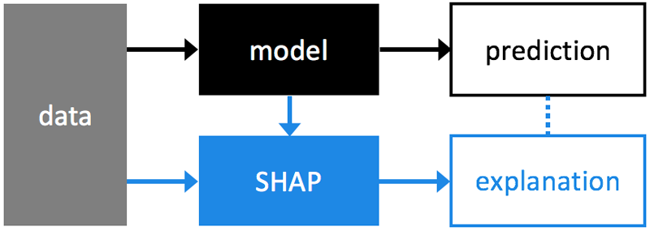

.. SHAP documentation master file, created by
   sphinx-quickstart on Tue May 22 10:44:55 2018.
   You can adapt this file completely to your liking, but it should at least
   contain the root `toctree` directive.

SHAP (SHapley Additive exPlanations) is a unified approach to explain the output of any machine
learning model. SHAP connects game theory with local explanations, uniting several previous
methods and representing the only possible consistent and locally accurate additive
feature attribution method based on expectations (see the SHAP NIPS paper for details).

.. toctree::
   :maxdepth: 2

Explainers
=====================

.. autoclass:: shap.TreeExplainer
   :members:

.. autoclass:: shap.KernelExplainer
   :members:

.. autoclass:: shap.DeepExplainer
   :members:

Plots
=====================

.. autofunction:: shap.summary_plot
.. autofunction:: shap.dependence_plot
.. autofunction:: shap.force_plot
.. autofunction:: shap.image_plot
