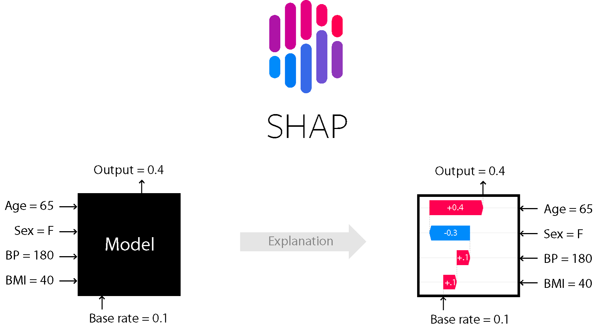

.. SHAP documentation master file, created by
   sphinx-quickstart on Tue May 22 10:44:55 2018.
   You can adapt this file completely to your liking, but it should at least
   contain the root `toctree` directive.

Welcome to the SHAP documentation
---------------------------------

**SHAP (SHapley Additive exPlanations)** is a game theoretic approach to explain the output of
any machine learning model. It connects optimal credit allocation with local explanations
using the classic Shapley values from game theory and their related extensions (see
`papers <https://github.com/shap/shap#citations>`_ for details and citations).

Install
=======

SHAP can be installed from either `PyPI <https://pypi.org/project/shap>`_ or
`conda-forge <https://anaconda.org/conda-forge/shap>`_::

   pip install shap
   or
   conda install -c conda-forge shap

.. toctree::
   :maxdepth: 2
   :caption: Introduction

   Topical overviews <overviews>

.. toctree::
   :maxdepth: 2
   :caption: Examples

   Tabular examples <tabular_examples>
   Text examples <text_examples>
   Image examples <image_examples>
   Genomic examples <genomic_examples>

.. toctree::
   :maxdepth: 2
   :caption: Reference

   API reference <api>
   API examples <api_examples>
   Benchmarks <benchmarks>

.. toctree::
   :maxdepth: 1
   :caption: Development

   Release notes <release_notes>
   Contributing guide <contributing>
